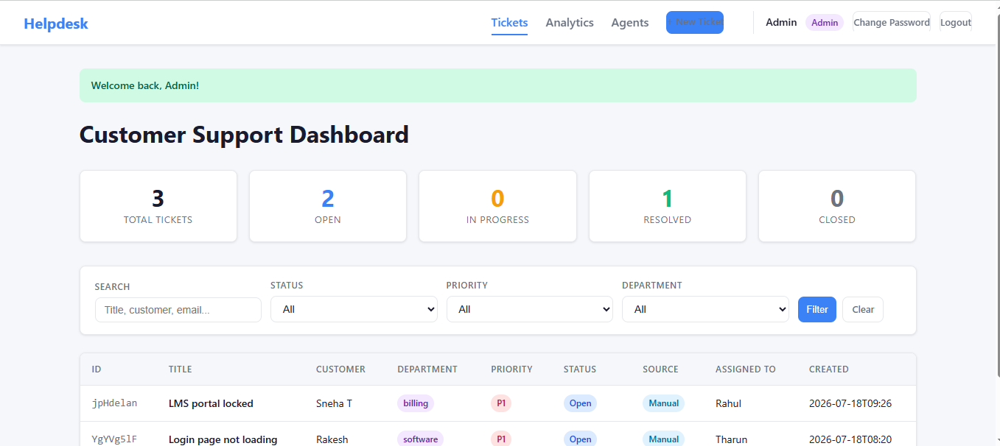
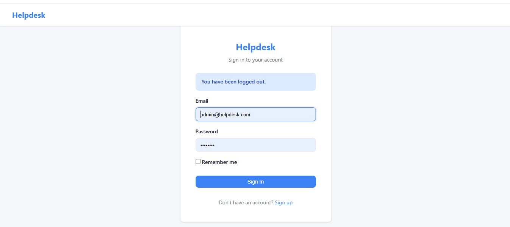
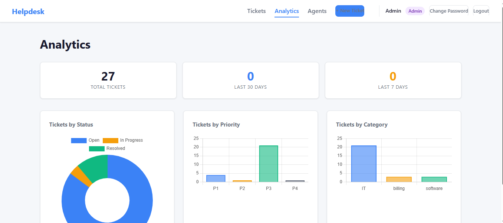
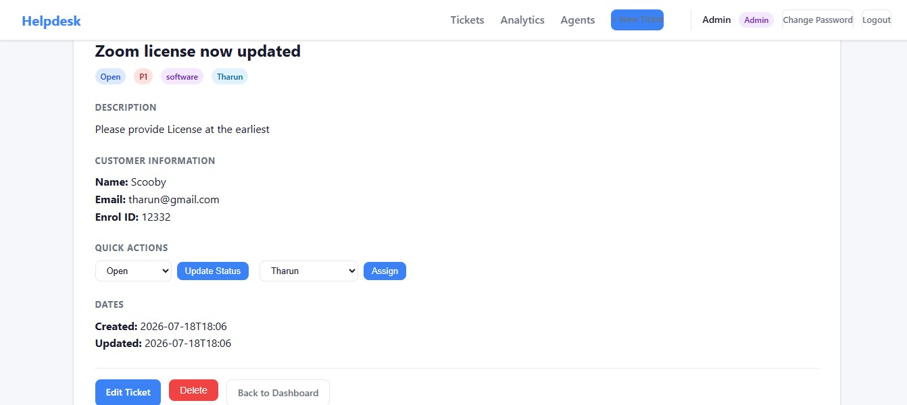
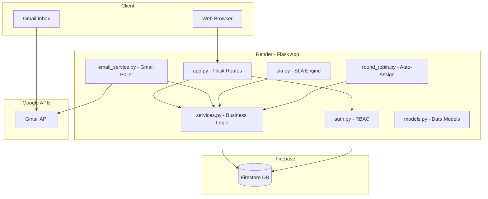

# Customer Issue Dashboard

A full-featured helpdesk ticketing system built with Flask and Firebase Firestore, featuring role-based access control, round-robin auto-assignment, SLA tracking, and Gmail email-to-ticket integration.



---

## Features

### Core Functionality
- **Ticket Management** — Create, edit, assign, resolve, and delete tickets with priority levels (P1–P4)
- **Role-Based Access Control** — Admin (full access) and Agent (assigned tickets only) roles
- **Round-Robin Auto-Assignment** — Tickets are automatically distributed to agents based on department and workload
- **SLA Tracking** — Response and resolution deadlines with breach detection per department/priority
- **Email-to-Ticket** — Auto-creates tickets from emails sent to a monitored Gmail inbox

### Agent Features
- View only tickets assigned to them
- Update ticket status (Open → In Progress → Resolved → Closed)
- Add comments (public or internal notes)
- Send tickets back to admin for reassignment

### Admin Features
- Full dashboard with filters (status, priority, department, assigned agent)
- Agent management (create, edit, deactivate, delete)
- Manual ticket assignment and reassignment
- Analytics with charts (tickets by status, priority, department)
- Ticket creation and editing with full customer details

### Technical Features
- Firebase Firestore for persistent, scalable storage
- Gmail API integration with OAuth2 authentication
- Session-based authentication with bcrypt password hashing
- Background SLA escalation worker (APScheduler)
- REST API alongside the web UI
- Responsive dark-themed UI

---

## Screenshots

| Login | Dashboard | Ticket Detail |
|-------|-----------|---------------|
|  |  |  |

---

## Tech Stack

| Layer | Technology |
|-------|-----------|
| **Backend** | Flask 3.1.1, Python 3.12 |
| **Database** | Firebase Firestore (via firebase-admin 6.6.0) |
| **Auth** | Flask-Login, bcrypt |
| **Email** | Gmail API (google-api-python-client) |
| **Scheduling** | APScheduler (background SLA worker) |
| **Production Server** | Gunicorn |
| **Frontend** | Jinja2 templates, Chart.js, CSS |
| **Hosting** | Render (free tier) |

---

## Architecture



---

## Local Setup

### Prerequisites
- Python 3.12+
- Firebase project with Firestore enabled
- Google Cloud project with Gmail API (optional, for email feature)

### 1. Clone the repository
```bash
git clone https://github.com/Sneha-T8015/customer-issue-dashboard.git
cd customer-issue-dashboard
```

### 2. Create a virtual environment
```bash
python -m venv venv
venv\Scripts\activate        # Windows
# source venv/bin/activate   # macOS/Linux
```

### 3. Install dependencies
```bash
pip install -r requirements.txt
```

### 4. Set up Firebase
Download your `serviceAccountKey.json` from Firebase Console → Project Settings → Service Accounts → Generate new private key. Place it in the project root.

### 5. Configure environment variables
Copy `.env.example` to `.env` and fill in:
```bash
SECRET_KEY=your-random-secret-key
ADMIN_EMAIL=admin@helpdesk.com
ADMIN_PASSWORD=changeme123
```

### 6. Run the app
```bash
python app.py
```

The app starts at `http://localhost:5000`. The admin account is auto-seeded on first boot.

---

## Environment Variables

| Variable | Required | Description |
|----------|----------|-------------|
| `SECRET_KEY` | Yes | Flask session signing key |
| `PORT` | No | Server port (default: 5000) |
| `ADMIN_EMAIL` | Yes | Admin login email (seeded on first boot) |
| `ADMIN_PASSWORD` | Yes | Admin login password |
| `FIREBASE_CREDENTIALS_JSON` | For deploy | Inline JSON of Firebase service account |
| `GOOGLE_APPLICATION_CREDENTIALS` | Alt | Path to Firebase service account JSON file |
| `GMAIL_CREDENTIALS_JSON` | For email | Inline JSON of Gmail OAuth client secrets |
| `GMAIL_TOKEN_JSON` | For email | Inline JSON of Gmail OAuth token |
| `GMAIL_ADMIN_USER` | For email | Gmail address to monitor (default: snehathangaraj5@gmail.com) |
| `GMAIL_POLL_INTERVAL` | No | Seconds between email polls (default: 300) |

---

## Deploy to Render (Free Tier)

### Step 1: Push to GitHub
```bash
git add .
git commit -m "Initial commit"
git push origin main
```

### Step 2: Create Web Service on Render
1. Go to [render.com](https://render.com) and sign up with GitHub
2. Click **New +** → **Web Service**
3. Connect your repository: `Sneha-T8015/customer-issue-dashboard`
4. Configure:
   - **Name:** `customer-issue-dashboard`
   - **Runtime:** Python 3
   - **Build Command:** `pip install -r requirements.txt`
   - **Start Command:** `gunicorn app:app`
   - **Instance Type:** Free

### Step 3: Set Environment Variables
On the Render dashboard, go to **Environment** tab and add:

```
SECRET_KEY=<generate-a-strong-random-key>
ADMIN_EMAIL=admin@helpdesk.com
ADMIN_PASSWORD=<your-secure-password>
FIREBASE_CREDENTIALS_JSON=<paste entire serviceAccountKey.json contents>
GMAIL_CREDENTIALS_JSON=<paste gmail credentials JSON>
GMAIL_TOKEN_JSON=<paste gmail token JSON>
GMAIL_ADMIN_USER=snehathangaraj5@gmail.com
```

### Step 4: Deploy
Render auto-deploys on every push to `main`. Your app will be live at:
```
https://your-app-name.onrender.com
```

### Render Free Tier Notes
- **Cold starts:** ~30–60 sec after 15 min of inactivity (normal for free tier)
- **750 hours/month:** enough for one service running 24/7
- **No persistent disk needed:** Firestore handles all data storage

---

## Gmail Email-to-Ticket Setup

### Google Cloud Console Setup
1. Go to [Google Cloud Console](https://console.cloud.google.com)
2. Select or create a project
3. Enable the **Gmail API** (APIs & Services → Library → search "Gmail")
4. Go to **Credentials** → **Create Credentials** → **OAuth 2.0 Client ID**
   - Application type: **Desktop app**
   - Name: `Helpdesk Gmail Integration`
5. Download the JSON file → save as `gmail_credentials.json` locally

### First-Time OAuth Consent
1. Place `gmail_credentials.json` in the project root
2. Run the app locally: `python app.py`
3. A browser window opens → sign in with `snehathangaraj5@gmail.com` → grant access
4. Token is cached in `gmail_token.json`

### For Production (Render)
Store the contents of both JSON files as environment variables:
- `GMAIL_CREDENTIALS_JSON` → contents of `gmail_credentials.json`
- `GMAIL_TOKEN_JSON` → contents of `gmail_token.json`

The app reads these at runtime and creates temporary files for the Gmail API client.

---

## Default Credentials

| Role | Email | Password |
|------|-------|----------|
| Admin | `admin@helpdesk.com` | `changeme123` |

> **Change these immediately** in production via environment variables.

---

## API Endpoints

| Method | Endpoint | Description |
|--------|----------|-------------|
| POST | `/api/tickets/create` | Create ticket with SLA + round-robin |
| GET | `/api/tickets` | List/filter tickets |
| GET | `/api/tickets/<id>` | Get single ticket |
| PATCH | `/api/tickets/<id>` | Update ticket fields |
| DELETE | `/api/tickets/<id>` | Delete ticket |
| GET | `/api/tickets/assigned/<agent_id>` | Agent's tickets with SLA remaining |
| GET | `/api/stats` | Aggregate ticket counts |
| GET | `/api/departments` | List departments |
| GET | `/api/sla/<dept_id>` | SLA policies for department |
| GET | `/api/agents` | List agents |
| POST | `/api/agents` | Create agent |
| POST | `/api/init` | Re-seed departments + SLA data |

---

## Project Structure

```
customer-issue-dashboard/
├── app.py                 # Flask routes (UI + REST API)
├── auth.py                # Flask-Login, RBAC, signup/login
├── email_service.py       # Gmail API email-to-ticket
├── firebase_config.py     # Firebase init, seed data
├── models.py              # Data models (Ticket, Department, etc.)
├── round_robin.py         # Round-robin agent assignment
├── services.py            # Firestore CRUD operations
├── sla.py                 # SLA policy engine
├── validators.py          # Input validation
├── requirements.txt       # Python dependencies
├── Procfile               # Render deployment config
├── runtime.txt            # Python version
├── .env.example           # Environment variable template
├── static/
│   └── css/style.css      # Dark theme styles
├── templates/
│   ├── base.html          # Layout with navbar
│   ├── login.html         # Sign in
│   ├── signup.html        # Register
│   ├── index.html         # Dashboard
│   ├── issue_detail.html  # Ticket detail + comments
│   ├── issue_form.html    # Create/edit ticket
│   ├── agents.html        # Agent list
│   ├── agent_form.html    # Create/edit agent
│   ├── analytics.html     # Charts & analytics
│   └── change_password.html
├── screenshots/           # App screenshots
└── tests/
    └── test_app.py        # Unit tests
```

---

## License

This project is for educational purposes.

---

## Recent Changes (2026-07-19)

- Agents can now edit a ticket's **Department** and **Priority** from the ticket edit form; agents remain limited to editing tickets assigned to them.
- Admins retain full edit rights (status, assignment, resolution notes, all fields).
- Email-to-ticket creation fix: incoming Gmail messages now produce tickets with proper `created_at`/`updated_at` timestamps so they render correctly in the dashboard.
- Round-robin assignment: admin accounts are excluded from auto-assignment and the algorithm will fall back to any active non-admin agents when a department has no active agents.
- Gmail poll interval reduced for faster processing (controlled by `GMAIL_POLL_INTERVAL`, default now `60` seconds).
- Startup/admin seeding: the app now loads environment variables at startup and will update the seeded admin account from `ADMIN_EMAIL` / `ADMIN_PASSWORD` on boot.
- Debug helper: call the `/api/test-gmail` endpoint (admin-only) to force an immediate Gmail poll and see how many tickets were created.

If you want these notes expanded into a changelog or added as release notes in GitHub, tell me where to put them and I can create a `CHANGELOG.md` or draft a release.
